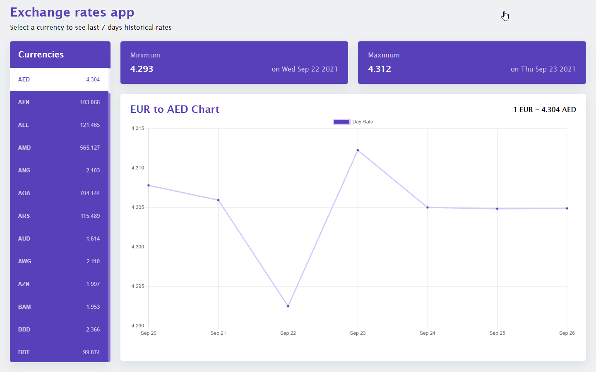

# Currency [Exchange Rates App](http://exchange-rates.morerabeatriz.com/)

You can see the project running at http://exchange-rates.morerabeatriz.com/



Currency exchange rates app using the https://exchangeratesapi.io/

## Functionalities

- The application displays all currencies available in the API together with their
  conversion rates (defaults to Euro).

- Allows the user to select a preferred currency.

- Displays a line graph showing the exchange rate for the last 7 days.

Note:

Since the free version of the API does not allowed access to the "timeseries" endpoint - request exchange rates for a specific period of time, I have used the "historical" endpoint - request historical rates for a specific day getting the exchange rate for the last 7 days.

## Configuration

### Environment Variables

Create a `.env` file at root level with the following content:

```env
  REACT_APP_BASE_URL="http://api.exchangeratesapi.io"
  REACT_APP_API_KEY="<secret>"
```

**replace the secret for the API KEY**

## Features

- [x] react-chartjs-2
- [x] Styled Components
- [x] Eslint (AirBnB configuration)
- [x] TypeScript

This project was bootstrapped with [Create React App](https://github.com/facebook/create-react-app).

## Available Scripts

In the project directory, you can run:

### `npm start`

Runs the app in the development mode.\
Open [http://localhost:3000](http://localhost:3000) to view it in the browser.

The page will reload if you make edits.\
You will also see any lint errors in the console.

### `npm test`

Launches the test runner in the interactive watch mode.\
See the section about [running tests](https://facebook.github.io/create-react-app/docs/running-tests) for more information.

### `npm run lint`

Runs _eslint_ to check code format and rules

### Deployment

This section has moved here: [https://facebook.github.io/create-react-app/docs/deployment](https://facebook.github.io/create-react-app/docs/deployment)
